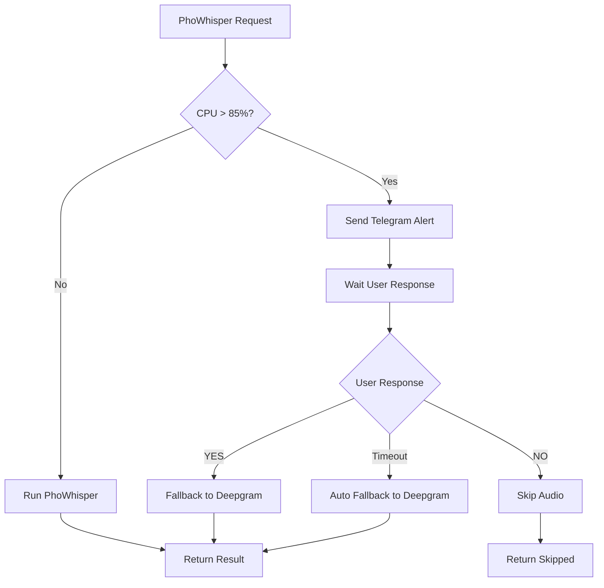

# 🚨 CPU Monitoring & Fallback Guide

## 📋 Tổng quan

Tính năng CPU monitoring được tích hợp vào `audio_processor.py` để bảo vệ server khi CPU quá cao khi chạy PhoWhisper. Khi CPU > 85%, hệ thống sẽ:

1. **Gửi cảnh báo qua Telegram**
2. **Chờ user response** (30 giây)
3. **Fallback sang Deepgram** nếu user đồng ý
4. **Bỏ qua audio** nếu user từ chối

## 🔧 Cấu hình

### 1. CPU Threshold
```python
# Trong audio_processor.py
self.cpu_threshold = 85.0  # Ngưỡng CPU (%) để cảnh báo
```

### 2. Telegram Bot Integration
```python
# Trong api_server.py
audio_processor.set_telegram_bot(telegram_bot)
```

## 🎯 Cách hoạt động

### Khi chạy PhoWhisper:

1. **Check CPU trước khi transcribe**
   ```python
   cpu_ok = await self.check_cpu_and_notify(audio_url)
   ```

2. **Nếu CPU > 85%:**
   - Gửi notification qua Telegram
   - Chờ user response 30 giây
   - Nếu user reply `YES` → Fallback sang Deepgram
   - Nếu user reply `NO` → Bỏ qua audio
   - Nếu timeout → Tự động fallback sang Deepgram

3. **Nếu CPU ≤ 85%:**
   - Chạy PhoWhisper bình thường

## 📱 Telegram Commands

### User Response Options:
- `YES` / `FALLBACK` / `OK` → Chuyển sang Deepgram
- `NO` / `REJECT` / `CANCEL` → Từ chối và bỏ qua

### Example Message:
```
🚨 CPU QUÁ CAO - PHOWHISPER TRANSCRIPTION

📊 Thông tin hệ thống:
• CPU: 92.3% (threshold: 85%)
• Memory: 78.5%

🎵 Audio đang xử lý:
https://conek-pbx.conek.vn/app/xml_cdr/download.php?id=abc123

⏰ Thời gian: 14:30:25 15/12/2024

⚠️ Hệ thống sẽ tự động chuyển sang Deepgram

🤖 Tùy chọn:
• Reply 'YES' để chuyển sang Deepgram ngay
• Reply 'NO' để từ chối và bỏ qua audio này
• Timeout: 30 giây
```

## 🔄 Fallback Flow



## 🛠️ API Response

### Success với PhoWhisper:
```json
{
  "success": true,
  "transcript": "Nội dung transcript...",
  "response": {...},
  "engine_used": "phowhisper"
}
```

### Success với Deepgram Fallback:
```json
{
  "success": true,
  "transcript": "Nội dung transcript...",
  "response": {...},
  "engine_used": "deepgram_fallback"
}
```

### Skipped (User từ chối):
```json
{
  "success": false,
  "message": "❌ User từ chối fallback sang Deepgram",
  "skipped": true
}
```

## 📊 Monitoring

### CPU & Memory Info:
```python
cpu_percent = processor.get_cpu_percent()
memory_percent = processor.get_memory_percent()
```

### System Info:
```python
system_info = {
    'cpu_percent': 92.3,
    'memory_percent': 78.5,
    'cpu_count': 8,
    'cpu_freq': {...},
    'timestamp': 1702647025.123
}
```

## 🔧 Customization

### 1. Thay đổi CPU Threshold:
```python
processor.cpu_threshold = 90.0  # 90% thay vì 85%
```

### 2. Thay đổi Timeout:
```python
# Trong check_cpu_and_notify()
return await self._wait_for_user_response(audio_url, timeout=60)  # 60s thay vì 30s
```

### 3. Custom Telegram Message:
```python
# Trong check_cpu_and_notify()
message = f"""
🚨 **CUSTOM CPU ALERT**

📊 **System Info:**
• CPU: {cpu_percent:.1f}%
• Memory: {memory_percent:.1f}%

🎵 **Audio:** `{audio_url}`

🤖 **Options:**
• Reply 'YES' for Deepgram
• Reply 'NO' to skip
"""
```

## 🧪 Testing

### Test CPU Check:
```python
# Set threshold thấp để trigger
processor.cpu_threshold = 1.0

# Test với audio URL
audio_url = "https://example.com/audio.wav"
cpu_ok = await processor.check_cpu_and_notify(audio_url)
```

### Test Fallback:
```python
# Mock Telegram bot
mock_bot = MockTelegramBot()
processor.set_telegram_bot(mock_bot)

# Test STT với fallback
stt_result = await processor._perform_stt(audio_path, audio_meta, audio_url)
```

## 🚀 Deployment

### 1. Docker Environment:
```yaml
# docker-compose.yml
environment:
  - STT_ENGINE=phowhisper
  - CPU_THRESHOLD=85.0
```

### 2. Environment Variables:
```bash
export CPU_THRESHOLD=85.0
export TELEGRAM_BOT_ENABLED=true
export TELEGRAM_ADMIN_CHAT_ID=your_chat_id
```

## 📝 Logs

### CPU Check Logs:
```
🔍 Checking CPU trước khi chạy PhoWhisper...
⚠️ CPU quá cao: 92.3% (threshold: 85%)
📱 Đã gửi CPU high alert cho https://example.com/audio.wav
🔄 CPU cao (92.3%), fallback sang Deepgram...
✅ FALLBACK SANG DEEPGRAM
```

### Success Logs:
```
✅ CPU OK: 45.2%
🎯 Chạy PhoWhisper transcription...
```

## 🔒 Security

- ✅ CPU monitoring chỉ hoạt động với PhoWhisper
- ✅ Deepgram không bị ảnh hưởng
- ✅ User có quyền kiểm soát fallback
- ✅ Timeout protection (30s)
- ✅ Error handling đầy đủ

## 🎯 Benefits

1. **Bảo vệ server** khỏi CPU overload
2. **Tự động fallback** sang Deepgram khi cần
3. **User control** qua Telegram
4. **Transparent logging** cho monitoring
5. **Zero downtime** cho service

## 🐛 Troubleshooting

### CPU Check không hoạt động:
- Kiểm tra `psutil` đã được cài đặt
- Kiểm tra Telegram bot đã được set
- Kiểm tra `audio_url` được truyền đúng

### Telegram notification không gửi:
- Kiểm tra `TELEGRAM_BOT_ENABLED=true`
- Kiểm tra `TELEGRAM_ADMIN_CHAT_ID`
- Kiểm tra network connection

### Fallback không hoạt động:
- Kiểm tra Deepgram API keys
- Kiểm tra `DEEPGRAM_API_KEYS` trong config
- Kiểm tra network connection đến Deepgram

---

**📞 Support:** Nếu có vấn đề, check logs và contact admin qua Telegram.
