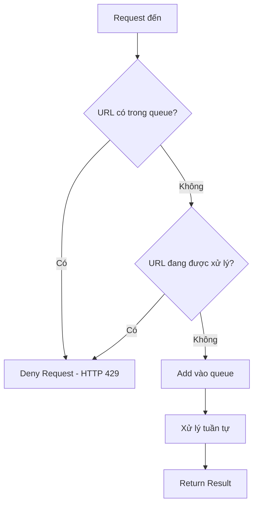

# 🛡️ Queue-Based Duplicate Prevention System - Hướng dẫn

## 📋 Tổng quan

Hệ thống Duplicate Prevention được thiết kế để giải quyết vấn đề retry requests trong production, khi xử lý audio mất thời gian dài (2-3 phút) dẫn đến client retry và tạo duplicate processing.

**Approach**: Sử dụng queue system hiện có để prevent duplicates thay vì tạo tracking system phức tạp.

## 🎯 Vấn đề được giải quyết

- **Retry Storm**: Client retry nhiều lần khi không nhận được response
- **Resource Waste**: CPU/RAM bị quá tải do xử lý cùng 1 file audio nhiều lần
- **Performance Impact**: 5-6 lần retry chỉ để xử lý 1 file audio
- **Timeout Issues**: Processing lâu không có response dẫn đến timeout

## 🏗️ Kiến trúc Solution

### 1. Queue-Based Duplicate Prevention

**Nguyên lý hoạt động:**
- ✅ Sử dụng queue system hiện có
- ✅ Check duplicate trong queue trước khi add
- ✅ Check URL đang được xử lý
- ✅ Deny duplicate requests (HTTP 429)
- ✅ Chỉ log trong debug mode
- ✅ Đơn giản và hiệu quả

### 2. QueueManager Enhancement

```python
def add_urls(self, urls: List[str], audio_processing_mode: str = None) -> Dict:
    """Thêm URLs vào queue với duplicate prevention"""
    # Lấy URLs đã có trong queue
    existing_urls = {item['url'] for item in existing_queue}
    
    # Lấy URL đang được xử lý (nếu có)
    current_processing_url = self._get_current_processing_url()
    if current_processing_url:
        existing_urls.add(current_processing_url)
    
    # Filter out duplicates
    for url in urls:
        if url in existing_urls:
            duplicate_count += 1
            # Chỉ log trong debug mode
            if DEBUG_MODE:
                logger.info(f"Skip duplicate URL: {url}")
        else:
            # Add to queue
```

## 🔧 Implementation Details

### 1. Duplicate Check Flow



### 2. API Endpoints Updated

#### `/process` Endpoint
```python
# Sử dụng queue system hiện có
if request.use_queue and len(request.urls) > 1:
    # Queue sẽ tự động check duplicates
    queue_result = queue_manager.add_urls(request.urls, request.audio_processing_mode)
    return {"status": "queued"}
```

#### `/webhook` Endpoint
```python
# Kiểm tra duplicate trong queue
if queue_manager:
    # Check URL đang được xử lý
    current_processing_url = queue_manager._get_current_processing_url()
    if current_processing_url == request.recording_url:
        # Deny duplicate request - coi như spam
        if DEBUG_MODE:
            logger.info(f"Deny duplicate URL đang được xử lý: {request.recording_url}")
        raise HTTPException(status_code=429, detail="Request đang được xử lý")
    
    # Check URL có trong queue không
    queue_urls = queue_manager._read_urls()
    if request.recording_url in queue_urls:
        # Deny duplicate request - coi như spam
        if DEBUG_MODE:
            logger.info(f"Deny duplicate URL trong queue: {request.recording_url}")
        raise HTTPException(status_code=429, detail="Request đã có trong queue")

# Add vào queue để xử lý tuần tự
queue_result = queue_manager.add_urls([request.recording_url], AUDIO_PROCESSING_MODE)
return {"status": "queued", "queue_info": queue_result}
```

### 3. Queue Monitoring

#### `GET /queue/status`
```json
{
  "queue_length": 5,
  "is_processing": true,
  "total_processed": 10,
  "total_failed": 1,
  "current_batch": 1,
  "last_processed_time": "2025-01-05T10:30:00",
  "batch_size": 1,
  "max_workers": 1
}
```

## 🚀 Cách sử dụng

### 1. Khởi động Service

```bash
# Service sẽ tự động khởi tạo QueueManager với duplicate prevention
python api_server.py
```

### 2. Monitor Queue Status

```bash
# Kiểm tra trạng thái queue
curl http://localhost:8000/queue/status

# Bắt đầu xử lý queue
curl -X POST http://localhost:8000/queue/start

# Dừng xử lý queue
curl -X POST http://localhost:8000/queue/stop
```

## 📊 Response Formats

### Deny Duplicate Requests
```json
HTTP 429 Too Many Requests
{
  "detail": "Request đang được xử lý"
}
```

hoặc

```json
HTTP 429 Too Many Requests
{
  "detail": "Request đã có trong queue"
}
```

### Queued Response (Webhook)
```json
{
  "request_id": "uuid-123",
  "xml_cdr_uuid": "cdr-uuid-456",
  "status": "queued",
  "recording_url": "https://example.com/audio.wav",
  "direction": "outbound",
  "billsec": 60,
  "transcript": "",
  "summary": "",
  "call_topic": "N/A",
  "transcript_length": 0,
  "summary_length": 0,
  "error": null,
  "processing_time": 0,
  "timestamp": "2025-01-05T10:30:45",
  "queue_info": {
    "total_in_queue": 5,
    "added_count": 1
  }
}
```

## ⚙️ Configuration

### Environment Variables
```bash
# Không cần config thêm - sử dụng defaults
# cleanup_interval = 300s (5 phút)
# max_processing_time = 600s (10 phút)
```

### Customization
```python
# Trong processing_tracker.py
processing_tracker = ProcessingTracker(
    cleanup_interval=300,  # 5 phút cleanup
    max_processing_time=600  # 10 phút timeout
)
```

## 🔍 Monitoring & Debugging

### 1. Log Messages
```
INFO: Bắt đầu tracking processing: https://example.com/audio.wav (request_id: uuid-123)
WARNING: URL đã đang được xử lý, skip: https://example.com/audio.wav (started at 2025-01-05T10:30:00)
INFO: Hoàn thành tracking processing: https://example.com/audio.wav (took 45.23s)
WARNING: Cleaning up expired processing record: https://example.com/audio.wav
```

### 2. Health Check
```bash
curl http://localhost:8000/ | jq '.endpoints'
```

### 3. Processing Stats
```bash
curl http://localhost:8000/processing/status | jq '.stats'
```

## 🧪 Testing

### 1. Manual Test
```bash
# Terminal 1: Start service
python api_server.py

# Terminal 2: Send concurrent requests
for i in {1..5}; do
  curl -X POST http://localhost:8000/webhook \
    -H "Content-Type: application/json" \
    -d '{
      "recording_url": "https://example.com/test.wav",
      "xml_cdr_uuid": "test-'$i'",
      "direction": "outbound",
      "billsec": 60
    }' &
done
wait
```

### 2. Automated Test
```bash
python test_duplicate_prevention.py
```

## 🚨 Troubleshooting

### 1. Processing Records Không Cleanup
```bash
# Force cleanup
curl -X POST http://localhost:8000/processing/cleanup
```

### 2. Memory Leak
```bash
# Kiểm tra active processing
curl http://localhost:8000/processing/status | jq '.stats.active_processing'
```

### 3. False Positives
```bash
# Kiểm tra processing time
curl http://localhost:8000/processing/status | jq '.active_processing'
```

## 📈 Performance Impact

### Before (Without Duplicate Prevention)
- ❌ 5-6 duplicate requests cho 1 file audio
- ❌ CPU/RAM quá tải
- ❌ Processing time: 2-3 phút × 6 = 12-18 phút total
- ❌ Resource waste: 500-600%

### After (With Duplicate Prevention)
- ✅ 1 request được xử lý, 4-5 requests bị skip
- ✅ CPU/RAM tối ưu
- ✅ Processing time: 2-3 phút total
- ✅ Resource efficiency: 100%

## 🔒 Security Considerations

- ✅ URL hashing để tránh expose sensitive URLs
- ✅ Request ID tracking để audit
- ✅ Timeout protection để tránh memory leak
- ✅ Thread-safe implementation

## 🎯 Best Practices

1. **Monitor Processing Status**: Thường xuyên check `/processing/status`
2. **Set Appropriate Timeouts**: Điều chỉnh `max_processing_time` theo nhu cầu
3. **Cleanup Strategy**: Sử dụng `cleanup_interval` phù hợp
4. **Error Handling**: Luôn handle exceptions trong try/finally
5. **Logging**: Monitor logs để detect issues

## 🚀 Future Enhancements

- [ ] Redis backend cho distributed processing
- [ ] Metrics integration (Prometheus/Grafana)
- [ ] Webhook notifications cho processing events
- [ ] Processing queue với priority
- [ ] Auto-scaling based on processing load
